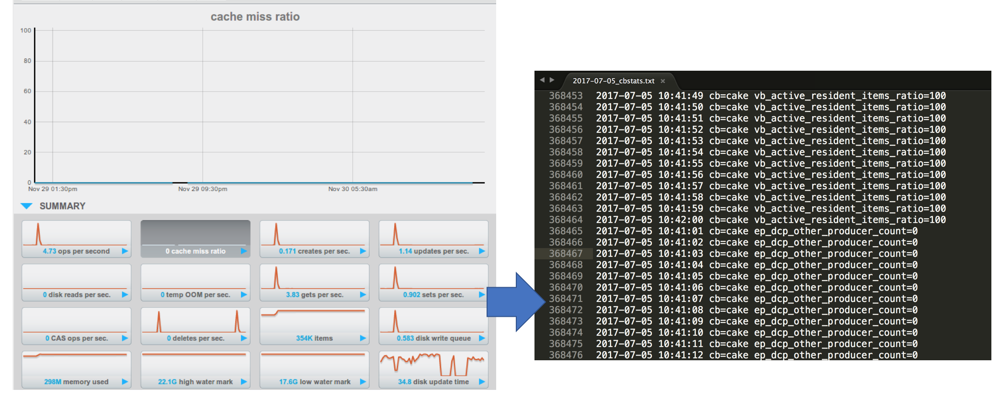
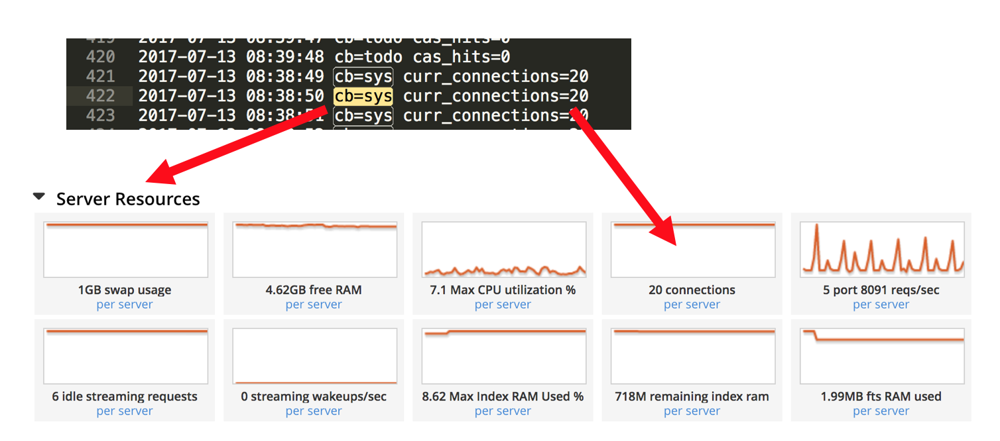
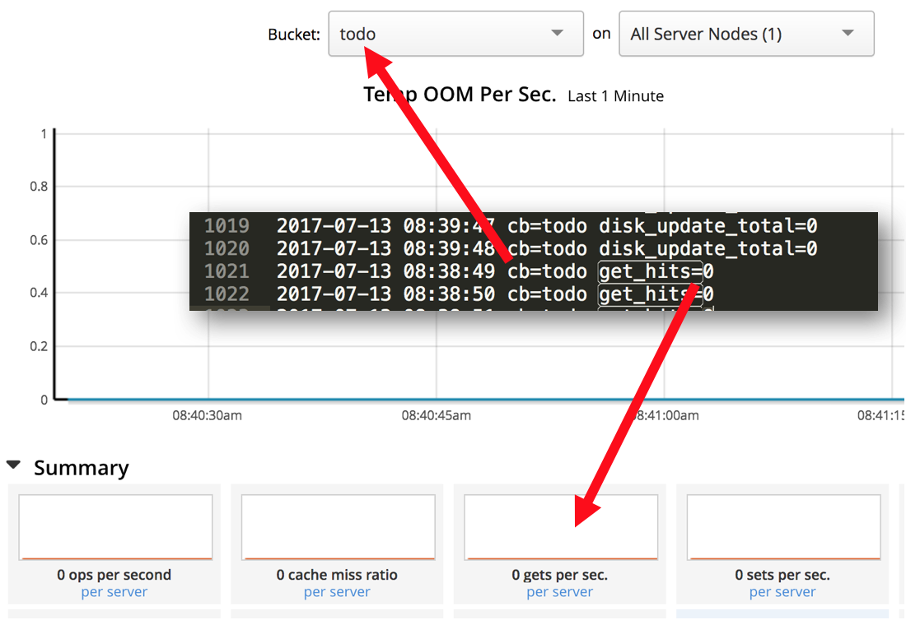

# cb-stats-demo
Mine Couchbase Server Status to a Log

Couchbase Server has great admin UI with lots of great metrics.
This script lets you capture those metrics and put them into a log.



**CONFIGURATION** 

Open the config.json file and update your settings.
```javascript

{
"hostname":"127.0.0.1",   (Put in your hostname or ip of the machine it getting the stats from)
"username":"readOnly",    (Put in the read-only username)
"password":"password",    (Put in the read-only password)
"path":"/your/log/path/to/cb-stats-demo/logs/",
"debug":false,
"port":"8091",
"secure":false
}
```
**RUNNING**

Insert into your cron tab 
```
* * * * * /usr/bin/python /path/to/cb-stats-demo/cb-stats-demo.py
```

**LOGS**




**FAQ**

Q:How big will the files/log get?

A:It will roughly get about 750KB per minute per bucket per server or about 0.8GB per day per bucket per server.


Q:Will the file size grow forever?

A: No, it is bound to a particular day. Example 2016-06-17_cbstats.txt will only have the stats for that day per server.


Q:How do I get rid of the logs that are XYZ days old?

A:Linux has a built in log rotation tool on the folder level. https://www.cyberciti.biz/faq/how-do-i-rotate-log-files/
In the future I'll come up with a built-in one.


Q:Where does the script collect the metrics from?

A:Couchbase Server has a REST end point on #http://{hostname}:8091/_uistats
which spits out a JSON with all the metrics per node per bucket for the last 60 seconds.


Q:Do I have to put my Couchbase Administrator username and password in the config file?

A:No Couchbase lets you create a Read-Only user with username and password that you can put in the config file.


Q:Can I collect all the stats for the whole cluster on one machine?

Q:You can, but its best to run the script on each machine to capture its local stats and have a logging agent consume the logs and send them to a third party tool.


Compatability: Couchbase Admin GUI System stats ,example CPU, is now treated in the admin gui as a CB service with the data been as "@system" much like @analytics @query . If you have an older version of CB 4.x or older please pull/download the branch  cb/4.x.
